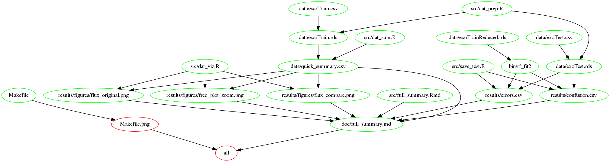

## A simple workflow pipeline for exoplanet study

*This project is primarily for the course `DSCI_522_Workflow` from UBC's MDS program, 2017*

### Overview

This project aims to build a workflow pipeline for studying [Kepler's data](https://www.nasa.gov/mission_pages/kepler/overview/index.html). The pipeline includes data processing and visualization, demonstrating simple machine learning model for detecting exoplanets, and automated report generation.

### Data

Data source: https://www.kaggle.com/keplersmachines/kepler-labelled-time-series-data

The original data are collected from Campaign 3 of Kepler's Mission. The Kaggle source filtered the original data and saved training and test data separately in csv.

The data contain the flux time series of over 3000 stars in the space. Flux is the brightness of a star measured by Kepler. When an exoplanent evolves inbetween the star and Kepler, it will block the light and thus the flux sensed by Kepler will decrease. This will occur periodally if a star has at least one exoplanet.


### Objectives

-   Data visualization: interactively plot flux data for each star
-   Data processing: clean up data for modeling. This involves removing outliers and Fourier Transform
-   Model for detecting exoplanets: build very simple model for classifying stars (have or do not have exoplanets)
-   Automation pipeline


### Scope

This project is mainly intended to present the workflow and build the automation pipeline.


### Structure

The project uses `make` to automate the R scripts in `src`. The following diagram illustrates all the dependencies.




### Download the project

```
git clone https://github.com/guanchenz/epstudy

# Make it your own
rm -rf .git
```

### Environment setup

The project uses Docker to manage working environment. Here is the link to the image: https://hub.docker.com/r/guanchenz/epstudy/.

```
# Get the image
docker pull guanchenz/epstudy

# Launch the image
docker run --rm -it guanchenz/epstudy /bin/bash
```

Internally, the image uses [packrat](https://rstudio.github.io/packrat/) to manage all the R libraries. You may `cd` into `/home/epstudy/packrat` and view `packrat.lock` to find all the dependencies used, or look at the `packrat.lock` included in the GitHub repo.

### Run

_Note: for the first run, it may take some time for `packrat` to setup the environment._

**Before you run**:

In all the commands below, replace <ABSOLUTE_DIR_WHERE_YOU_CLONED_THIS_PROJECT> with the **full** path to where you cloned this project from GitHub. This allows Docker to mount the volume so that the scripts in this project folder will run in the environment inside the Docker image and save results in your local machine. You do not need to setup the environment on your local machine.

-   Run all analyses and generate report

```
# use the default star (1)
docker run --rm -v <ABSOLUTE_DIR_WHERE_YOU_CLONED_THIS_PROJECT>:/home/epstudy guanchenz/epstudy make -C '/home/epstudy' all

# manually select the star you are interested in
# this will prompt for a star index between 1-3000
docker run --rm -it -v <ABSOLUTE_DIR_WHERE_YOU_CLONED_THIS_PROJECT>:/home/epstudy guanchenz/epstudy make -C '/home/epstudy' all
```

-   Generate plots for the selected star only. No report

```
docker run --rm -it -v <ABSOLUTE_DIR_WHERE_YOU_CLONED_THIS_PROJECT>:/home/epstudy guanchenz/epstudy make -C '/home/epstudy' plots
```

-   Cleanup

You may need to remove the intermediate results from previous runs to enable new make

```
# This only removes the csv file the plots depend on
docker run --rm -v <ABSOLUTE_DIR_WHERE_YOU_CLONED_THIS_PROJECT>:/home/epstudy guanchenz/epstudy make -C '/home/epstudy' clean

# This removes all the intermediate files
docker run --rm -v <ABSOLUTE_DIR_WHERE_YOU_CLONED_THIS_PROJECT>:/home/epstudy guanchenz/epstudy make -C '/home/epstudy' clean_all
```

-   Change machine learning model

You may also want to change the pre-built machine learning model included in `./bin`. If you only want to change the training data, run:

```
docker run --rm -v <ABSOLUTE_DIR_WHERE_YOU_CLONED_THIS_PROJECT>:/home/epstudy guanchenz/epstudy make -C '/home/epstudy' bin/rf_fit2
```

If you want to change the model parameters or plug in your own model, consider modifying the script in `./src`. This project uses _H2O_ for building machine learning model. If you need to setup _H2O_, modify `Dockerfile` and include `jre` and/or `jdk` in your new build.


### Output

The fully automated report (markdown) is located in `./doc`. Plots are saved in `./results/figures`.

Three types of plots are provided:

-   time series of the original flux data
-   comparison between the original flux data and filtered
-   harmonics of the flux data (full and zommed in)

The auotmated report also includes the result from a simple pre-built machine learning model that classifies the stars. Follow the steps in _Run_ to modify the model.
