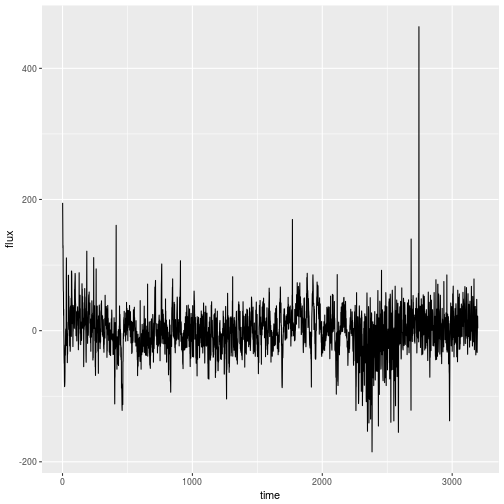

## Get data


```r
library(tidyverse)
```


```r
raw_df <- read_csv("../data/exoTrain.csv")
```

```
## Parsed with column specification:
## cols(
##   .default = col_double(),
##   LABEL = col_integer()
## )
```

```
## See spec(...) for full column specifications.
```

```r
head(raw_df)
```

```
## # A tibble: 6 x 3,198
##   LABEL   FLUX.1   FLUX.2   FLUX.3   FLUX.4   FLUX.5   FLUX.6  FLUX.7
##   <int>    <dbl>    <dbl>    <dbl>    <dbl>    <dbl>    <dbl>   <dbl>
## 1     2    93.85    83.81    20.10   -26.98   -39.56  -124.71 -135.18
## 2     2   -38.88   -33.83   -58.54   -40.09   -79.31   -72.81  -86.55
## 3     2   532.64   535.92   513.73   496.92   456.45   466.00  464.50
## 4     2   326.52   347.39   302.35   298.13   317.74   312.70  322.33
## 5     2 -1107.21 -1112.59 -1118.95 -1095.10 -1057.55 -1034.48 -998.34
## 6     2   211.10   163.57   179.16   187.82   188.46   168.13  203.46
## # ... with 3190 more variables: FLUX.8 <dbl>, FLUX.9 <dbl>, FLUX.10 <dbl>,
## #   FLUX.11 <dbl>, FLUX.12 <dbl>, FLUX.13 <dbl>, FLUX.14 <dbl>,
## #   FLUX.15 <dbl>, FLUX.16 <dbl>, FLUX.17 <dbl>, FLUX.18 <dbl>,
## #   FLUX.19 <dbl>, FLUX.20 <dbl>, FLUX.21 <dbl>, FLUX.22 <dbl>,
## #   FLUX.23 <dbl>, FLUX.24 <dbl>, FLUX.25 <dbl>, FLUX.26 <dbl>,
## #   FLUX.27 <dbl>, FLUX.28 <dbl>, FLUX.29 <dbl>, FLUX.30 <dbl>,
## #   FLUX.31 <dbl>, FLUX.32 <dbl>, FLUX.33 <dbl>, FLUX.34 <dbl>,
## #   FLUX.35 <dbl>, FLUX.36 <dbl>, FLUX.37 <dbl>, FLUX.38 <dbl>,
## #   FLUX.39 <dbl>, FLUX.40 <dbl>, FLUX.41 <dbl>, FLUX.42 <dbl>,
## #   FLUX.43 <dbl>, FLUX.44 <dbl>, FLUX.45 <dbl>, FLUX.46 <dbl>,
## #   FLUX.47 <dbl>, FLUX.48 <dbl>, FLUX.49 <dbl>, FLUX.50 <dbl>,
## #   FLUX.51 <dbl>, FLUX.52 <dbl>, FLUX.53 <dbl>, FLUX.54 <dbl>,
## #   FLUX.55 <dbl>, FLUX.56 <dbl>, FLUX.57 <dbl>, FLUX.58 <dbl>,
## #   FLUX.59 <dbl>, FLUX.60 <dbl>, FLUX.61 <dbl>, FLUX.62 <dbl>,
## #   FLUX.63 <dbl>, FLUX.64 <dbl>, FLUX.65 <dbl>, FLUX.66 <dbl>,
## #   FLUX.67 <dbl>, FLUX.68 <dbl>, FLUX.69 <dbl>, FLUX.70 <dbl>,
## #   FLUX.71 <dbl>, FLUX.72 <dbl>, FLUX.73 <dbl>, FLUX.74 <dbl>,
## #   FLUX.75 <dbl>, FLUX.76 <dbl>, FLUX.77 <dbl>, FLUX.78 <dbl>,
## #   FLUX.79 <dbl>, FLUX.80 <dbl>, FLUX.81 <dbl>, FLUX.82 <dbl>,
## #   FLUX.83 <dbl>, FLUX.84 <dbl>, FLUX.85 <dbl>, FLUX.86 <dbl>,
## #   FLUX.87 <dbl>, FLUX.88 <dbl>, FLUX.89 <dbl>, FLUX.90 <dbl>,
## #   FLUX.91 <dbl>, FLUX.92 <dbl>, FLUX.93 <dbl>, FLUX.94 <dbl>,
## #   FLUX.95 <dbl>, FLUX.96 <dbl>, FLUX.97 <dbl>, FLUX.98 <dbl>,
## #   FLUX.99 <dbl>, FLUX.100 <dbl>, FLUX.101 <dbl>, FLUX.102 <dbl>,
## #   FLUX.103 <dbl>, FLUX.104 <dbl>, FLUX.105 <dbl>, FLUX.106 <dbl>,
## #   FLUX.107 <dbl>, ...
```


```r
idx <- 32 #1525
h_exo_train <- t(raw_df[idx,])
h_exo_train <- h_exo_train[2:length(h_exo_train)]
h_exo_train <- tibble(
  time = 1:length(h_exo_train),
  flux = h_exo_train
)

h_exo_train %>%
  ggplot(aes(x = time, y = flux)) + geom_path()
```



