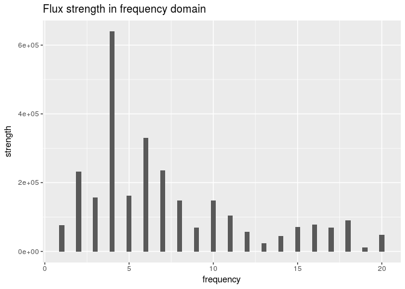
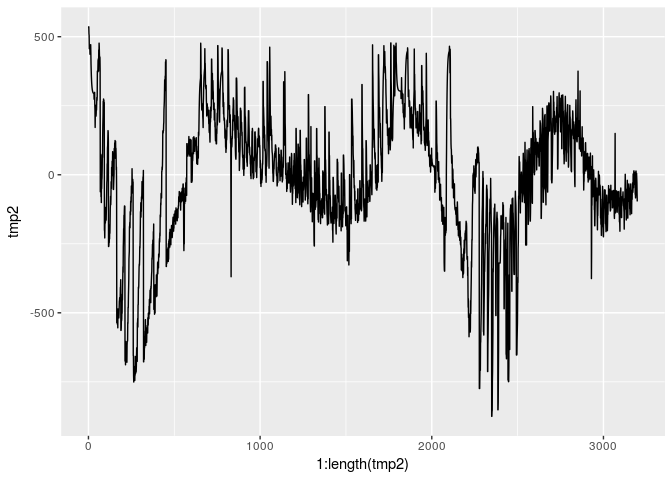

quick\_results
================
GZ
December 10, 2017

Quick results that visualize the flux data
------------------------------------------

``` r
library(tidyverse)
```

    ## Loading tidyverse: ggplot2
    ## Loading tidyverse: tibble
    ## Loading tidyverse: tidyr
    ## Loading tidyverse: readr
    ## Loading tidyverse: purrr
    ## Loading tidyverse: dplyr

    ## Conflicts with tidy packages ----------------------------------------------

    ## filter(): dplyr, stats
    ## lag():    dplyr, stats

### Load the data from rds

``` r
raw <- readRDS('../data/exoTrain.rds')
star_index <- 3
```

### Quick look at the data

``` r
head(raw[, 1:10])
```

    ## # A tibble: 6 x 10
    ##   LABEL   FLUX.1   FLUX.2   FLUX.3   FLUX.4   FLUX.5   FLUX.6  FLUX.7
    ##   <int>    <dbl>    <dbl>    <dbl>    <dbl>    <dbl>    <dbl>   <dbl>
    ## 1     2    93.85    83.81    20.10   -26.98   -39.56  -124.71 -135.18
    ## 2     2   -38.88   -33.83   -58.54   -40.09   -79.31   -72.81  -86.55
    ## 3     2   532.64   535.92   513.73   496.92   456.45   466.00  464.50
    ## 4     2   326.52   347.39   302.35   298.13   317.74   312.70  322.33
    ## 5     2 -1107.21 -1112.59 -1118.95 -1095.10 -1057.55 -1034.48 -998.34
    ## 6     2   211.10   163.57   179.16   187.82   188.46   168.13  203.46
    ## # ... with 2 more variables: FLUX.8 <dbl>, FLUX.9 <dbl>

### Load external functioins for data analysis

``` r
source("../src/dat_utils.R")
```

### Filter the data and apply fourier transform

``` r
# get flux series for one star
series0 <- raw[star_index, ]

# remove outliers
series_filtered <- rm_upper_outlier(series0)

# fourier transform
xk <- fft(as.numeric(series_filtered[2:length(series_filtered)]))  # this returns a vector of complex numbers
harmonics <- 2 * Mod(xk)  # complex numbers to real
series_fft <- as_tibble(t(harmonics))
series_fft <- series_fft %>%
  mutate(LABEL = raw[star_index, ]$LABEL) %>%
  select(LABEL, everything())

names(series_fft) <- colnames(raw)

# results
df <- series_fft
df[2,] <- series_filtered
df[3,] <- series0
df <- df %>% mutate(type = c('frequency', 'time_filtered', 'time0')) %>%
  select(type, everything())
```

### Visualize flux data in time and frequency domains

``` r
ncols <- dim(df)[2]
ncols_freq <- round(ncols/2)

# use line to have better viz
freq_plot_full <- ggplot() +
  geom_line(aes(1:(ncols_freq-2), as.numeric(df[1, 3:ncols_freq]))) +
  scale_x_continuous("frequency") +
  scale_y_continuous("strength") +
  ggtitle("Flux strength in frequency domain")

# bar
freq_plot_zoom <- ggplot() +
  aes(1:20, as.numeric(df[1, 3:22])) +
  geom_bar(stat = 'identity', width = 0.3) +
  scale_x_continuous("frequency") +
  scale_y_continuous("strength") +
  ggtitle("Flux strength in frequency domain")

tmp2 <- as.numeric(df[2, 3:ncols])
# tmp3 <- as.numeric(df[3, 3:ncols])
flux <- ggplot() +
  geom_line(aes(1:length(tmp2), tmp2)) #+
  # geom_line(aes(1:length(tmp3), tmp), color = 'red', alpha=0.8)
```

``` r
freq_plot_zoom
```



``` r
flux
```


