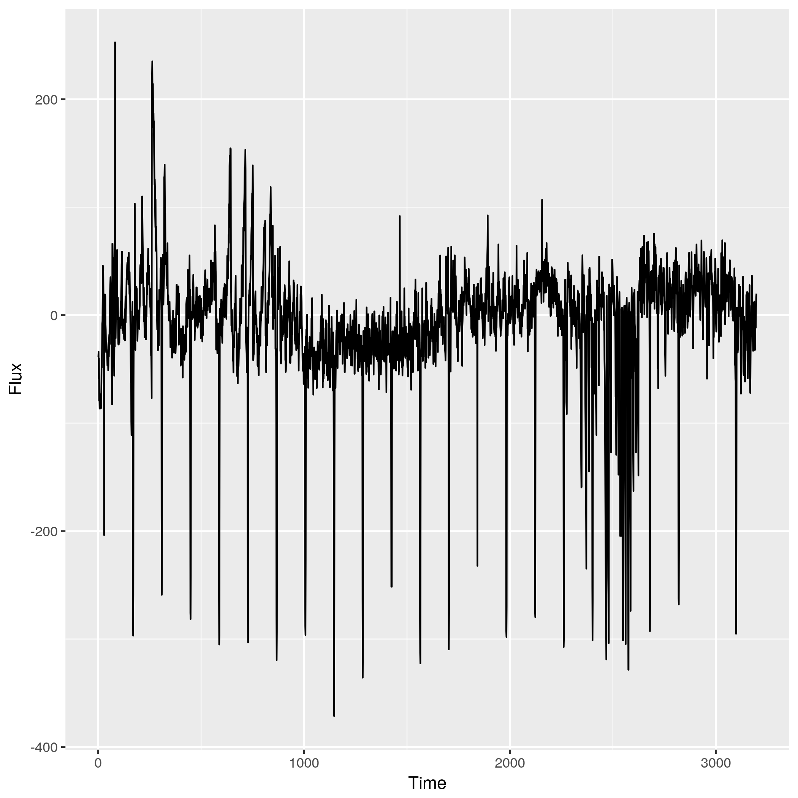
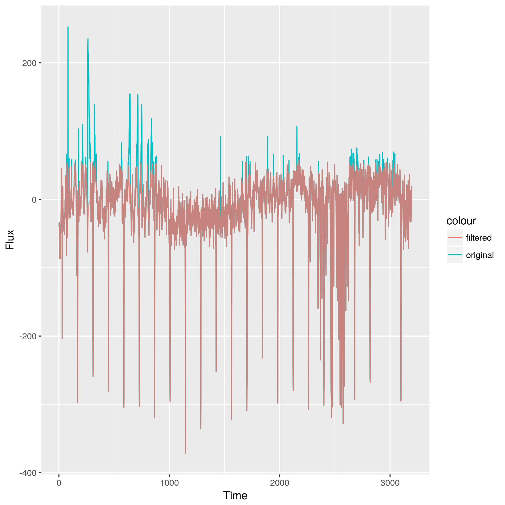

## Auto-generate summary (Full verison)


```r
# load libraries
library(tidyverse)
```

### Overview

This summary shows the following:

-   Load the flux data and understand the data format
-   Plot the data to understand the data
-   Perform data processing the plot the processed data
-   Demonstrate a sample classification using a pre-compiled naive machine learning model

### Load the data

The flux data in csv format downloaded from Kaggle is first compressed to rds. Below shows how to load the compressed training data.


```r
raw <- readRDS('./data/exoTrain.rds')

# Show the first 10 columns of star 2, 10, 20, 50, 60, 70
head(raw[c(2, 10, 20, 50, 60, 70), 1:10])
```

```
## # A tibble: 6 x 10
##   LABEL  FLUX.1  FLUX.2  FLUX.3  FLUX.4  FLUX.5  FLUX.6  FLUX.7  FLUX.8
##   <int>   <dbl>   <dbl>   <dbl>   <dbl>   <dbl>   <dbl>   <dbl>   <dbl>
## 1     2  -38.88  -33.83  -58.54  -40.09  -79.31  -72.81  -86.55  -85.33
## 2     2 -265.91 -318.59 -335.66 -450.47 -453.09 -561.47 -606.03 -712.72
## 3     2  560.19  262.94  189.94  185.12  210.38  104.19  289.56  172.06
## 4     1 -355.12 -348.74 -373.37 -362.00 -291.00 -195.00  -77.12 -161.37
## 5     1  -42.97 -127.45 -101.61  -98.31  -71.39  -71.73  -84.81  -68.61
## 6     1 -115.54  -96.29 -103.12  -97.60  -79.73  -61.62  -77.75  -60.79
## # ... with 1 more variables: FLUX.9 <dbl>
```

As shown above, the data consist of a `LABEL` column and `FLUX` columns (measured at different times). `LABEL` refers to whether the star is confirmed to have at least one planet. `2` indicates yes and `1` refers to no.

`FLUX` refers to the brightness over area measured in the [Kepler Mission](https://www.nasa.gov/mission_pages/kepler/main/index.html). Negative `FLUX` means there is some object (potentially exoplanets) blocks the star. Positive `FLUX` could indicate spot or other interference in the space.


### Interpret the data

One approach for detecting exoplanets is based on [transit](https://en.wikipedia.org/wiki/Methods_of_detecting_exoplanets#Transit_photometry). When the star and any of its exoplanets are aligned with Kepler's observation point, the flux measured by Kepler would decrease. When the exoplanet no longer blocks the light, the flux will increase.

Below show the flux time series for the selected star. We are mainly interested in the downward peaks that correspond to the possibility that some planet periodically blocks the light.




### Load external functioins for data analysis

The `dat_utils` script includes data utility functions that remove the outliers and perform Fourier Transform.


```r
source("../dat_utils.R")
```

```
## Warning in file(filename, "r", encoding = encoding): cannot open file '../
## dat_utils.R': No such file or directory
```

```
## Error in file(filename, "r", encoding = encoding): cannot open the connection
```


### Filter the data and apply fourier transform

From the plot above, we may see some positive peaks that do not occur periodically and we do not know what caused these positive peaks. In transit, because we mainly consider the negative peaks, we may consider filtering out these positive peaks.

Another thing to consider is to apply Fourier Transform on the flux data in time series. Because the time series data could be interferred by unknown sources which may not be periodical, we may transform the time series data to the frequency domain to find periodical patterns. However, the effectivenss of the transformation in detecting exoplanets remain to be studied.


```r
# define star index first
# star_index <- 3

# get flux series for one star
series0 <- raw[star_index, ]

# remove outliers
series_filtered <- rm_upper_outlier(series0)

# fourier transform
xk <- fft(as.numeric(series_filtered[2:length(series_filtered)]))  # this returns a vector of complex numbers
harmonics <- 2 * Mod(xk)  # complex numbers to real
series_fft <- as_tibble(t(harmonics))
series_fft <- series_fft %>%
  mutate(LABEL = raw[star_index, ]$LABEL) %>%
  select(LABEL, everything())

# set the column names of series_fft to be same as raw
names(series_fft) <- colnames(raw)

# results
df <- series_fft
df[2,] <- series_filtered
df[3,] <- series0
df <- df %>% mutate(type = c('frequency', 'time_filtered', 'time0')) %>%
  select(type, everything())
```


### Visualize flux data in time and frequency domains




### Classifying whether a star has exoplanet

Below shows a very simple random forest model (in `./bin/`) that takes the flux time series ad input and classifies whether the star has exoplanets.

One of the challenges in the building the model is that the training data is extremely unbalanced, that is, only 37 out of 5000 stars have exoplanents. To tackle this issue, I divide each observation (a flux time series for a star) into 3 segments, assuming each segment is for one star. Thus, I can achieve `37*3=111` observations in the training set for stars that have exoplanets.

To further address the unbalance in training data, the random forest model is trained with `balance_classes=TRUE`. For details of how to build this model, please refer to `./src/build_mdl_reduce.R`.


```r
## Build Random Forest model based on raw data (no removing outliers)

library(h2o)

h2o.init(nthreads = -1)
```

```
## 
## H2O is not running yet, starting it now...
## 
## Note:  In case of errors look at the following log files:
##     /tmp/RtmpPas2bB/h2o_guanchen_started_from_r.out
##     /tmp/RtmpPas2bB/h2o_guanchen_started_from_r.err
## 
## 
## Starting H2O JVM and connecting: . Connection successful!
## 
## R is connected to the H2O cluster: 
##     H2O cluster uptime:         1 seconds 243 milliseconds 
##     H2O cluster version:        3.14.0.3 
##     H2O cluster version age:    2 months and 23 days  
##     H2O cluster name:           H2O_started_from_R_guanchen_fhy706 
##     H2O cluster total nodes:    1 
##     H2O cluster total memory:   1.73 GB 
##     H2O cluster total cores:    2 
##     H2O cluster allowed cores:  2 
##     H2O cluster healthy:        TRUE 
##     H2O Connection ip:          localhost 
##     H2O Connection port:        54321 
##     H2O Connection proxy:       NA 
##     H2O Internal Security:      FALSE 
##     H2O API Extensions:         XGBoost, Algos, AutoML, Core V3, Core V4 
##     R Version:                  R version 3.4.2 (2017-09-28)
```

```r
col_range <- 1:1066
# test_raw <- read_csv("../data/exoTest.csv")
test_raw <- readRDS('./data/exoTest.rds')
dat_test_f_raw <- test_raw #toFFT(test_raw[, 1:1066])
dat_test2 <- as.h2o(dat_test_f_raw[, col_range], destination_frame="dat_test2")
```

```
## 
  |                                                                       
  |                                                                 |   0%
  |                                                                       
  |=================================================================| 100%
```

```r
dat_test2$LABEL <- as.factor(dat_test2$LABEL)
```

```
## Error in unique.default(x, nmax = nmax): invalid type/length (environment/0) in vector allocation
```

```r
# dat_test_scaled2 <- dat_test2
# dat_test_scaled2[, 2:dim(dat_test_scaled2)[2]] <- h2o.scale(dat_test_scaled2[, 2:dim(dat_test_scaled2)[2]]) 

col_range <- 1:dim(dat_test2)[2]
rf_model <- h2o.loadModel("./bin/rf_fit2")

rf_perf <- h2o.performance(model = rf_model,
  newdata = dat_test2[, col_range])

rf_perf
```

```
## H2OBinomialMetrics: drf
## 
## MSE:  0.008707997
## RMSE:  0.09331665
## LogLoss:  0.05026151
## Mean Per-Class Error:  0.1141593
## AUC:  0.9711504
## Gini:  0.9423009
## 
## Confusion Matrix (vertical: actual; across: predicted) for F1-optimal threshold:
##          1  2    Error     Rate
## 1      549 16 0.028319  =16/565
## 2        1  4 0.200000     =1/5
## Totals 550 20 0.029825  =17/570
## 
## Maximum Metrics: Maximum metrics at their respective thresholds
##                         metric threshold    value idx
## 1                       max f1  0.003663 0.320000  18
## 2                       max f2  0.003663 0.500000  18
## 3                 max f0point5  0.003663 0.235294  18
## 4                 max accuracy  0.009755 0.989474   0
## 5                max precision  0.003663 0.200000  18
## 6                   max recall  0.003049 1.000000  29
## 7              max specificity  0.009755 0.998230   0
## 8             max absolute_mcc  0.003663 0.391067  18
## 9   max min_per_class_accuracy  0.003049 0.952212  29
## 10 max mean_per_class_accuracy  0.003049 0.976106  29
## 
## Gains/Lift Table: Extract with `h2o.gainsLift(<model>, <data>)` or `h2o.gainsLift(<model>, valid=<T/F>, xval=<T/F>)`
```

The results show that the model needs further training. Possible improvement could include:

-   obtain more training and testing data or generate new data from the available data
-   further filter the data to extract better features and to remove noise

Nevertheless, we can use the results to locate where the errors occur and to have a close look at the specific stars to find any irregularities.
